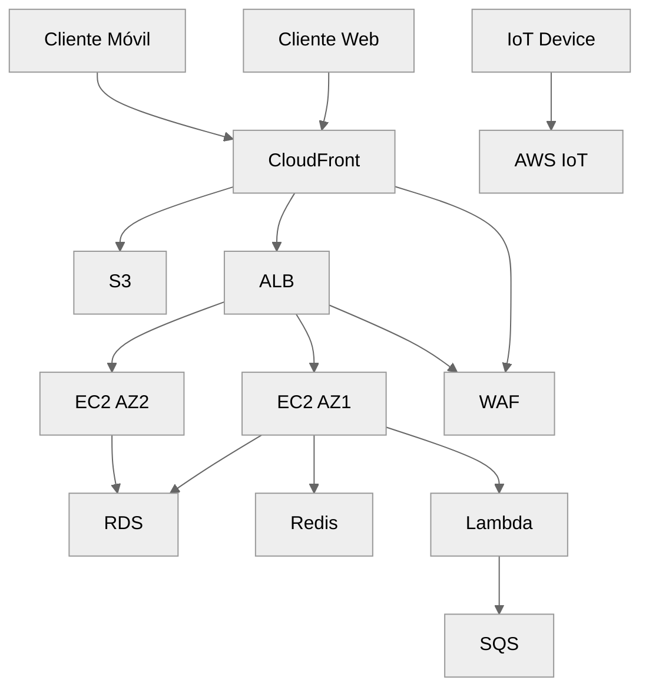
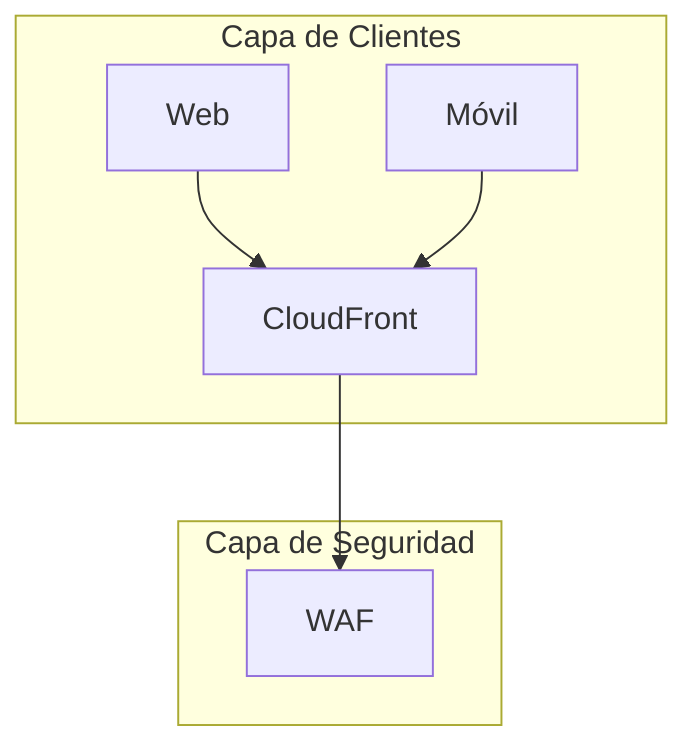
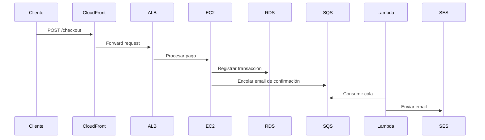

**Diagrama de arquitectura cloud completo con todas las capas**, diseñado para mostrar el flujo de datos, componentes críticos y decisiones técnicas en detalle:

---

### **Desglose por Capas Técnicas**:

#### **1. Capa de Clientes** 🏃‍♂️

- **Web/Móvil**: Acceso via HTTPS (TLS 1.3).
- **IoT**: Protocolo MQTT seguro con AWS IoT Core.
- *Decisión*: Terminación SSL en CloudFront para reducir carga en backend.

#### **2. Capa de Entrega** 🌐

- **CloudFront**: Cachea contenido en 300+ Edge Locations.
- **ALB**: Enrutamiento basado en rutas (path-based routing).
- *Decisión*: ALB sobre NLB para soportar WebSockets.

#### **3. Capa de Aplicación** 🖥️

- **EC2 Auto Scaling**: Escalado basado en métricas custom (ej: conexiones activas).
- **Lambda**: Timeout configurado a 15 mins (máximo para procesos async).
- *Decisión*: Redis sobre Memcached por persistencia opcional.

#### **4. Capa de Datos** 🗃️

- **RDS**: Backups automáticos con PITR (Point-in-Time Recovery).
- **S3 Storage Classes**: Standard (acceso frecuente) + Glacier (archivo).
- *Decisión*: Multi-AZ con failover automático (<30 segundos).

#### **5. Capa de Seguridad** 🔐

- **WAF**: Reglas contra OWASP Top 10 (SQLi, XSS).
- **KMS**: Claves gestionadas por AWS (AWS-Managed Keys).
- *Decisión*: IAM Roles en lugar de credenciales estáticas.

#### **6. Capa de Monitoreo** 📊

- **CloudWatch Alarms**: Umbrales para CPU (>80%), errores 5xx (>1%).
- **Auto Recovery**: Reinicio automático de instancias EC2 fallidas.
- *Decisión*: SNS para notificaciones multi-canal (Slack + SMS).

---

### **Flujo Crítico (Ejemplo: Proceso de Pago)**:

---
