Aquí tienes un **diagrama de arquitectura cloud completo con todas las capas**, diseñado para mostrar el flujo de datos, componentes críticos y decisiones técnicas en detalle:

```mermaid
%%{init: {'theme': 'neutral', 'fontFamily': 'Arial', 'gantt': {'barHeight': 20}}}%%
graph TD
    %% ==================== CAPA DE CLIENTES ====================
    A[Cliente Web] -->|HTTPS| B[CloudFront]
    A2[Cliente Móvil] -->|API REST| B
    A3[IoT Device] -->|MQTT| IOT[AWS IoT Core]

    %% ==================== CAPA DE ENTREGA ====================
    B --> C[S3 Bucket\n(Static Assets)]
    B --> D[Application Load Balancer]
    D --> E1[EC2 Auto Scaling\n(AZ1)]
    D --> E2[EC2 Auto Scaling\n(AZ2)]

    %% ==================== CAPA DE APLICACIÓN ====================
    E1 --> F[Amazon RDS\n(PostgreSQL Multi-AZ)]
    E2 --> F
    E1 --> G[ElastiCache Redis\n(Session Cache)]
    E2 --> G
    E1 --> H[Lambda\n(Async Tasks)]
    H --> J[SQS/SNS]
    J --> H

    %% ==================== CAPA DE DATOS ====================
    F --> K[Backup Automatizado\n(S3 + Glacier)]
    G --> L[Backup Diario\n(S3)]
    H --> M[CloudWatch Logs]

    %% ==================== CAPA DE SEGURIDAD ====================
    B --> N[WAF\n(Web Application Firewall)]
    D --> N
    E1 --> O[IAM Roles\n(Least Privilege)]
    E2 --> O
    F --> P[KMS Encryption\n(At Rest)]
    C --> P

    %% ==================== CAPA DE MONITOREO ====================
    M --> Q[CloudWatch Alarms]
    Q --> R[SNS Notifications\n(Slack/Email)]
    Q --> S[AWS Auto Recovery]

    %% ==================== LEYENDAS ====================
    style A fill:#2ecc71,color:white
    style A2 fill:#2ecc71,color:white
    style A3 fill:#2ecc71,color:white
    style B fill:#3498db,color:white
    style C fill:#3498db,color:white
    style D fill:#3498db,color:white
    style E1 fill:#e74c3c,color:white
    style E2 fill:#e74c3c,color:white
    style F fill:#9b59b6,color:white
    style G fill:#9b59b6,color:white
    style H fill:#f39c12,color:black
    style IOT fill:#1abc9c,color:white
    style N fill:#e67e22,color:white
    style P fill:#e67e22,color:white
    style Q fill:#95a5a6,color:black
```

---

### **Desglose por Capas Técnicas**:

#### **1. Capa de Clientes** 🏃‍♂️
- **Web/Móvil**: Acceso via HTTPS (TLS 1.3).
- **IoT**: Protocolo MQTT seguro con AWS IoT Core.
- *Decisión*: Terminación SSL en CloudFront para reducir carga en backend.

#### **2. Capa de Entrega** 🌐
- **CloudFront**: Cachea contenido en 300+ Edge Locations.
- **ALB**: Enrutamiento basado en rutas (path-based routing).
- *Decisión*: ALB sobre NLB para soportar WebSockets.

#### **3. Capa de Aplicación** 🖥️
- **EC2 Auto Scaling**: Escalado basado en métricas custom (ej: conexiones activas).
- **Lambda**: Timeout configurado a 15 mins (máximo para procesos async).
- *Decisión*: Redis sobre Memcached por persistencia opcional.

#### **4. Capa de Datos** 🗃️
- **RDS**: Backups automáticos con PITR (Point-in-Time Recovery).
- **S3 Storage Classes**: Standard (acceso frecuente) + Glacier (archivo).
- *Decisión*: Multi-AZ con failover automático (<30 segundos).

#### **5. Capa de Seguridad** 🔐
- **WAF**: Reglas contra OWASP Top 10 (SQLi, XSS).
- **KMS**: Claves gestionadas por AWS (AWS-Managed Keys).
- *Decisión*: IAM Roles en lugar de credenciales estáticas.

#### **6. Capa de Monitoreo** 📊
- **CloudWatch Alarms**: Umbrales para CPU (>80%), errores 5xx (>1%).
- **Auto Recovery**: Reinicio automático de instancias EC2 fallidas.
- *Decisión*: SNS para notificaciones multi-canal (Slack + SMS).

---

### **Flujo Crítico (Ejemplo: Proceso de Pago)**:

```mermaid
sequenceDiagram
    Cliente->>+CloudFront: POST /checkout
    CloudFront->>+ALB: Forward request
    ALB->>+EC2: Procesar pago
    EC2->>+RDS: Registrar transacción
    EC2->>+SQS: Encolar email de confirmación
    Lambda->>+SQS: Consumir cola
    Lambda->>+SES: Enviar email
```


---

