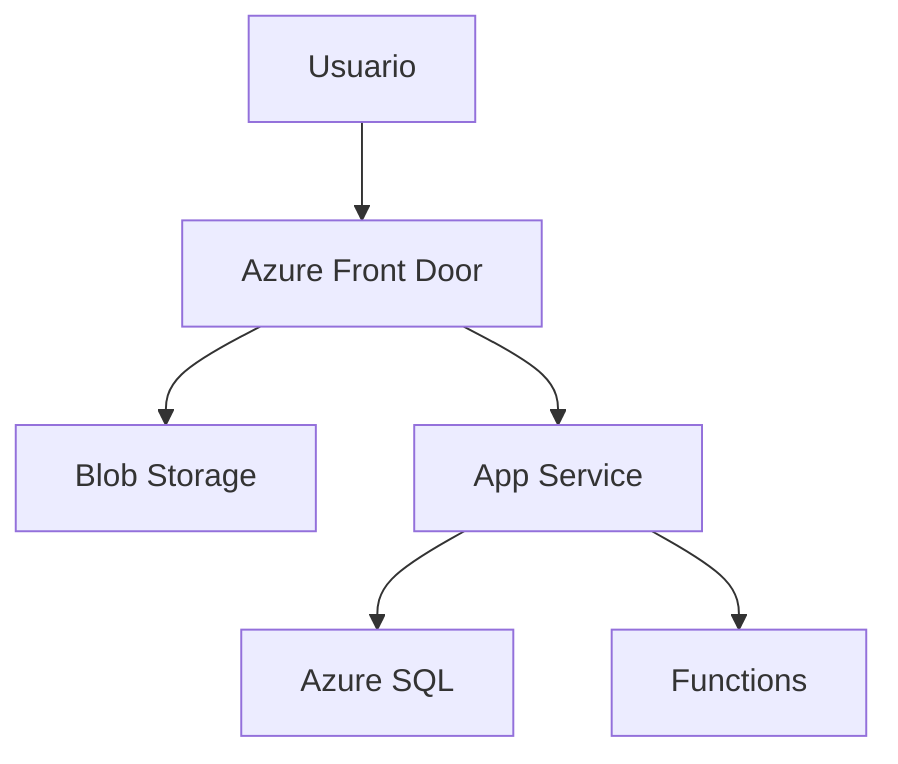

## 📄 **Documentación Técnica Detallada**

### **1. Requisitos del Sistema**

#### **Hardware Mínimo (para entorno local de desarrollo)**
- **CPU**: 4 núcleos (Intel i5/Ryzen 5 o superior)
- **RAM**: 8GB (16GB recomendado para Docker/Kubernetes)
- **Almacenamiento**: 50GB SSD (para bases de datos locales)

#### **Software Requerido**
| Componente       | Versión Mínima | Notas                          |
|------------------|----------------|--------------------------------|
| Python           | 3.9            | Para backend Django/Flask      |
| Node.js          | 16.x           | Si se usa Express.js           |
| Docker           | 20.10+         | Para contenedores              |
| Terraform        | 1.3+           | Infraestructura como código    |
| AWS CLI/Azure CLI| Última stable  | Gestión de recursos cloud      |

---

### **2. Servicios Cloud Específicos**

#### **AWS (Amazon Web Services)**
| Servicio   | Uso en el Proyecto                     | Configuración Recomendada          |
|------------|----------------------------------------|------------------------------------|
| **EC2**    | Hosting de instancias backend          | t3.micro (entorno dev), t3.large (prod) |
| **RDS**    | Base de datos PostgreSQL               | db.t3.small (50GB almacenamiento)  |
| **S3**     | Almacenamiento de imágenes/archivos    | Bucket con versionamiento habilitado |
| **Lambda** | Funciones serverless para procesos batch | Runtime Python 3.9                |

#### **Microsoft Azure**
| Servicio        | Uso en el Proyecto                  | Configuración Recomendada          |
|-----------------|-------------------------------------|------------------------------------|
| **App Service** | Despliegue de aplicaciones web      | Plan B1 (entorno dev), P2V3 (prod) |
| **Azure SQL**   | Base de datos relacional            | Gen5, 2 vCores                     |
| **Blob Storage**| Almacenamiento de documentos        | Nivel de acceso "Hot"              |
| **Functions**   | Procesamiento de colas              | Plan Consumption                   |

---

### **3. Guía de Implementación Detallada**

#### **Para AWS (usando Terraform)**
```bash
# Inicializar Terraform (descarga providers)
terraform init

# Validar sintaxis
terraform validate

# Planificación (previsualizar cambios)
terraform plan -var="instance_type=t3.micro"

# Aplicar cambios
terraform apply -var="instance_type=t3.micro"

# Destruir recursos (para limpieza)
terraform destroy
```

#### **Para Azure (usando Azure CLI)**
```bash
# Crear grupo de recursos
az group create --name MyResourceGroup --location eastus

# Desplegar App Service
az webapp up --sku B1 --name my-app-service --os-type Linux
```

---

### **4. Dependencias Clave**

#### **Backend Python (requirements.txt)**
```
Django==4.2
psycopg2-binary==2.9.6  # Para PostgreSQL
boto3==1.26.0           # SDK AWS
```

#### **Frontend React (package.json extracto)**
```json
{
  "dependencies": {
    "react": "^18.2.0",
    "axios": "^1.3.0",
    "aws-amplify": "^5.3.0"
  }
}
```

---

### **5. Diagramas de Configuración**

#### **AWS Architecture**
```mermaid
graph TD
    A[Cliente] --> B[CloudFront CDN]
    B --> C[S3 (Static Files)]
    B --> D[EC2 (Backend API)]
    D --> E[RDS PostgreSQL]
    D --> F[Lambda (Async Tasks)]
```

#### **Azure Architecture**


---

### **6. Checklist de Implementación**

1. [ ] Configurar credenciales de cloud provider (AWS/Azure CLI)
2. [ ] Clonar repositorio de infraestructura como código
3. [ ] Ejecutar `terraform init` + `terraform apply`
4. [ ] Desplegar backend en instancia EC2/App Service
5. [ ] Configurar conexión a base de datos
6. [ ] Implementar CI/CD (GitHub Actions/Azure Pipelines)

---

### **7. Solución de Problemas Comunes**

| Error                         | Causa Probable                     | Solución                          |
|-------------------------------|------------------------------------|-----------------------------------|
| "Invalid AWS Credentials"     | Variables de entorno no configuradas | Ejecutar `aws configure`          |
| Terraform "Provider Error"    | Versión incompatible del provider  | Ejecutar `terraform init -upgrade`|
| App Service 500 Error         | Dependencias no instaladas         | Revisar `requirements.txt` en Kudu|

---

### **8. Enlaces de Referencia**
- [AWS Well-Architected Framework](https://aws.amazon.com/architecture/well-architected/)
- [Azure Architecture Center](https://learn.microsoft.com/en-us/azure/architecture/)
- [Terraform Best Practices](https://www.terraform-best-practices.com/)

